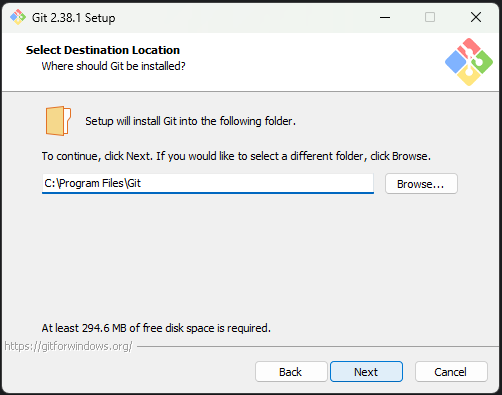
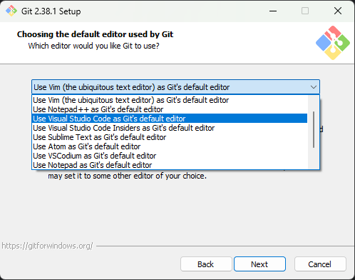
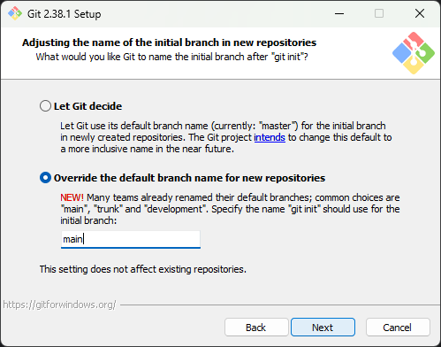
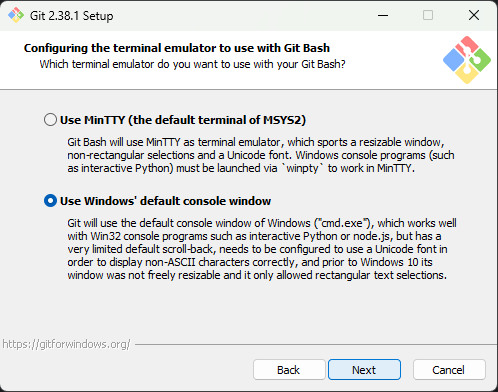
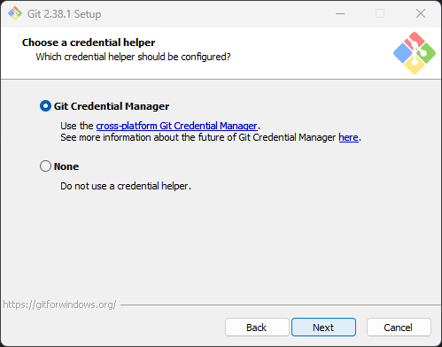
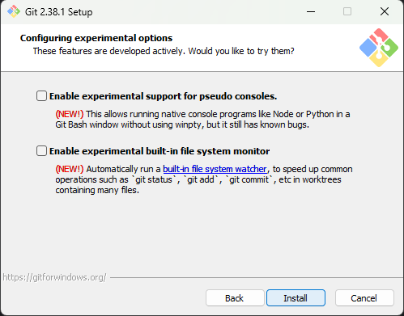

# Git Credential Manager (GCM)

With all the different options for authenticating on GitHub, thought was given
to finding a way to imptove the authentication experience for all users of 
GitHub's services. Given the difficulties with setting up certain
authentication methods on different platforms, GitHub sought to create a 
unified authentication experience that simply works. Thus, Git Credential
Manager (GCM) was created.

## Making GitHub Auth a Little Easier

Once GitHub moved to a more secure tokenized authentication, developers were
left without a means of authenticating through their terminals without using a
Personal Access Token (PAT) or setting up SSH authorization. Both had their 
hiccups -- WSL users found themselves without a secure means of storing their 
token without turning to 3rd party solutions, and the terminal prompts led to 
some confusion as it stil prompted a user's e-mail and password when it really 
wanted email and PAT. Mac users had a somewhat easier time as Keychain Acess 
would detect authorization requests on Terminal and store login information,
but the same prompts still led to some confusion. 

The other option was setting up SSH authorization, which again for WSL users
meant some system changes as no SSH process was running by default. Then 
generating a secure public and private key (it didn't help that GitHub's 
accepted hashing algorithms changed _after_ the transition to a passwod-less
experience) and making the choice of whether or not add a pass-key that needed
to be entered in order to gain access to the key. Then, linking it all up to
GitHub and ensuring that each time a user was interacting with GitHub they were
grabbing the appropriate SSH link rather than the HTTPS link. 

With all of those difficulties, couldn't there be an easier way to interact 
with remote repositories to make the development life cycle a bit easier?

## Enter GCM

Rather than splitting folks between differing means of authentication, a 
unified utility was created to work cross-platform and seamlessly integrate a 
user's credentials into their requests to remote repositories. By integrating
itself into a platform's existing identity management systems (Keychain Access
on MacOS and Windows Credential Manager on Windows) GCM provides a secure,
standardized means of maintaining access to remote repositories. These 
technologies make use of hardware driven security (Trusted Platform Module for
Windows users and Secure Enclave for Macs) to ensure that any credentials 
handled are given the utmost regard for security, providing us the most robust
means of maintaining secure access and account security. 

While both PAT and SSH can provide reliable means of Authentication once 
properly setup and configured, the additional hurdles (and occasional issues)
encountered in either setup leads us to recommend setting up Git Credential
Manager to ensure a more reliable authentication experience.

Below, we'll dive in to setting up GCM for MacOS users and WSL users alike. 
Linux users are able to set up and make use of GCM as well, however due to the
diversity in Linux environments and peculiarities of individual hardware, Linux
support will not be provided by instructional staff at this time. 

## Installing GCM
Below you'll find instructions for getting GCM set up on your computer. Please
follow the instructions for [MacOS Setup](#macos-setup) or 
[WSL Setup](#wsl-setup) based on which type of computer you'll be completing 
your coursework on.

### MacOS Setup

#### Homebrew directions
The GCM creators recommend using Homebrew to install GCM. To get started, 
you'll need to add the Homebrew tap for GCM with the following command:
```sh
brew tap microsoft/git
```
Once that operation is completed, you can install the GCM cask from the tap we 
just added:
```sh
brew install --cask git-credential-manager-core
```
Once that's complete you're all set! From time to time you may need to get some
updates to GCM. To get those updates, run
```sh
brew upgrade git-credential-manager-core
```
It might be a good idea to keep that command handy just in case you get any 
terminal warnings about GCM needing an update or upgrade.

Lastly, if for any reason you need to uninstall GCM, that operation can be 
completed with the following command: 
```sh
brew uninstall --cask git-credential-manager-core
```
Once you've got GCM installed, head down to [Testing GCM](#testing-gcm)

#### MacOS Package
It should be noted that the following is not the preferred means of installing 
GCM on MacOS. These instructions are here for anyone having trouble completing 
the install using Homebrew.

GCM Can also be installed on MacOS using an installation package provided by 
the GCM team. [Here's a link][GCM Latest Release] to the latest GCM release.
Once the installation package has been downloaded, double click
and follow the instructions on screen.

To uninstall GCM installed in this manner, you'll need to run the following
command in your terminal:
```sh
sudo /usr/local/share/gcm-core/uninstall.sh
```
Once you've got GCM installed, head down to [Testing GCM](#testing-gcm)


### WSL Setup
This will be a two-part process. First, we'll download and install the Git for
Windows package. This installer contains to most up to date release of GCM as 
well as some extras that will better integrate Git technologies into Windows
itself. After that's completed, we'll make sure the Git we're interacting with
through Ubuntu can find the credential manager and forward any auth requests 
to it.

#### Windows Directions
First, we'll head over to [this link][Git SCM for Windows] and then click on
the link that says Click here to download

Once the file is downloaded go ahead and open it to begin the installation. 
Click Next on the first screen, then, importantly _do not_ change the install
location for Git. Changing the location will make the next part much more
difficult, make sure it _does not get changed_. Image for reference:



On the next screen you don't need to make any changes, click Next. Then Next
again.

We should be on a screen that's asking us to choose a default edtior used by 
Git. Using the Options provided in the drop down menu, select "Use Visual
Studio Code as Git's default editor" then click Next



On the next screen we'll choose the "Override the default branch name for new
repositories" option and provide the value `main` for our intial branch. Once
we have that set, click Next



We can leave the `Recommended` option (Git from the command line and also 
3rd-party software) checked and click Next on this screen. Then Next again to
Use bundled OpenSSH, and Next one more time to Use the OpenSSL library. 

Make sure Checkout Windows-style, commit Unix-style line endings is selected, 
then click Next again. On the next screen, select Use Windows' default console
window, then click Next



On the next scren, leave Default (fast-forward or merge) selected and click 
Next. And finally we'll get to the most important screen of the entire 
installer, make sure to leave Git Credential Manager selected then click Next



On the next screen we'll only want Enable file system caching checked when we 
click Next. And, finally, we will not check either option on the next screen 
but we will click Install



You will see a progress bar reporting the Install's progress, then finally an 
option to finish the install. You can View Release Notes if you'd like, but the
Windows side of the install is complete once we click Finish.

### WSL Directions
If you followed the directions for installing Git for Windows as outlined 
above, the next steps should be easy enough. Open up your Ubuntu terminal and
enter this command:
```sh
git config --global credential.helper "/mnt/c/Program\ Files/Git/mingw64/bin/git-credential-manager.exe"
```
This line of code tells our Git where it can locate the Git Credential Manager
in your Windows environment. Now, any time we need an authorized Git request,
WSL will send a signal out to GCM on Windows to handle the auth side of things
and we can avoid the mess of configuring SSH or a PAT.

## Testing GCM
After you've completed the install for your system, test to make sure GCM is 
working by attempting to clone or push to a private repository. You should get
prompted by a new Window to enter your GitHub credentials, or, optionally enter
a PAT to authenticate. Upon providing your credentials, your terminal should 
report it's success with the given operation.

<!-- External Links -->
[GCM Latest Release]: https://github.com/GitCredentialManager/git-credential-manager/releases/latest
[Git SCM for Windows]: https://git-scm.com/download/win